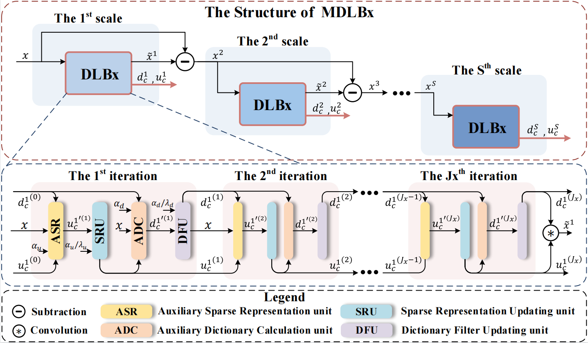

# DeepM<sup>2</sup>CDL: Deep Multi-scale Multi-modal Convolutional Dictionary Learning Network
- This is the official repository of the paper "DeepM<sup>2</sup>CDL: Deep Multi-scale Multi-modal Convolutional Dictionary Learning Network" from **IEEE Transactions on Pattern Analysis and Machine Intelligence (TPAMI)**. [[Paper Link]](https://ieeexplore.ieee.org/document/10323520, "Paper Link"),[[Pdf Link]](https://ieeexplore.ieee.org/stamp/stamp.jsp?tp=&arnumber=10323520, "Pdf Link")





## 1. Environment
- Python >= 3.5
- PyTorch == 1.7.1 is recommended
- opencv-python = =3.4.9.31
- tqdm
- scikit-image == 0.15.0
- scipy == 1.3.1 
- Matlab

## 2. Training and testing dataset
- ***For flash guided non-flash image denoising task***, we randomly select image pairs from  Aksoy dataset for training (400 image pairs) and testing (12 image pairs). 
- ***For RGB guided depth image super-resolution task***, the training data is from the DPDN dataset and the testing datasets are from the Middlebury dataset and the Sintel dataset.  
- ***For multi-focus image fusion task***, we generate the training data from DIV2K dataset and the testing image pairs for multi-focus image fusion are from the Lytro Mutli-focus image dataset. 
- ***For multi-exposure image fusion task***, the training data are from the SICE dataset. The testing images are from SICE dataset, MEFB dataset and  PQA-MEF dataset.

All the training and testing images for different MIP tasks used in this paper can be downloaded from the [[Google Drive Link]](https://drive.google.com/drive/folders/1Dpjl7KPrDtrbstNjgxzwYjhvlu4OWlrb?usp=sharing)


## 3. Test
### 🛠️  Clone this repository:
```
    git clone https://github.com/JingyiXu404/TPAMI-DeepM2CDL.git
```
### 🛠️  Download pretrained models:
```
    https://drive.google.com/drive/folders/1Sef-rFosbzu40h9NH3J1wDyd-w4clfAj?usp=sharing
```
### 💓  For flash guided non-flash image denoising task
**1. Prepare dataset**: If you do not use same datasets as us, place the test images in `Flash_Guide_Nonflash_Denoise/code/data/denoise/`.

```
    denoise
    └── test_flash
        └── flash
            ├──  1.png 
            ├──  2.png
            └──  3.png
        └── other test datasets
    └── test_nonflash
        └── nonflash
            ├──  1.png 
            ├──  2.png
            └──  3.png
        └── other test datasets
   ```

**2. Setup configurations**: In `Flash_Guide_Nonflash_Denoise/code/options/MMIR_test_denoising_new.json`.

```
    "root": "debug/N25"
    "pretrained_netG": "../Results_models/N25/"
    "sigma": [25], // noise level [25,50,75]}
```

**3. Run**: 

```
   cd Flash_Guide_Nonflash_Denoise/code/
   python MMIR_test_dcdicl.py
```

### 🐍 For RGB guided depth image super-resolution task
**1. Prepare dataset**: If you do not use same datasets as us, place the test images in `RGB_Guide_Depth_Super-resolution/code/data/depth_sr/`.

```
    depth_sr
    └── test_depth
        └── depth
            ├──  1.png 
            ├──  2.png
            └──  3.png
        └── other test datasets
    └── test_lr
        └── depth_lr
            ├──  1.png 
            ├──  2.png
            └──  3.png
        └── other test datasets
    └── test_rgb
        └── rgb
            ├──  1.png 
            ├──  2.png
            └──  3.png
        └── other test datasets
   ```

**2. Run**: 

```
   cd RGB_Guide_Depth_Super-resolution/code/
   python MMIR_test_dcdicl_sr.py
```
### 🧪 For multi-focus image fusion task
**1. Prepare dataset**: If you do not use same datasets as us, place the test images in `Multi-Focus_Fusion/code/data/multi-focus/`.

```
    multi-focus
    └── test_A
        └── source_A
            ├──  1.png 
            ├──  2.png
            └──  3.png
        └── other test datasets
    └── test_B
        └── source_B
            ├──  1.png 
            ├──  2.png
            └──  3.png
        └── other test datasets
   ```

**2. Run**: 

```
   cd Multi-Focus_Fusion/code/
   python MMIF_test_mf.py
```

## 4. ReTrain
### 🛠️  Clone this repository:
```
    git clone https://github.com/JingyiXu404/TPAMI-DeepM2CDL.git
```
### 💓  For flash guided non-flash image denoising task
**1. Prepare dataset**: If you do not use same datasets as us, place the test images in `Flash_Guide_Nonflash_Denoise/code/data/denoise/`.

```
    denoise
    └── test_flash
        └── flash
            ├──  1.png 
            └──  2.png
        └── other test datasets
    └── test_nonflash
        └── nonflash
            ├──  1.png 
            └──  2.png
        └── other test datasets
    └── train_flash
    └── train_nonflash
   ```

**2. Setup configurations**: In `Flash_Guide_Nonflash_Denoise/code/options/MMIR_test_denoising_new.json`.

```
    "pretrained_netG": null
    "G_optimizer_lr": 1e-4, // learning rate
    "checkpoint_test": 10, // testing per xx epoch
    "checkpoint_savemodel": 50, // saving model per xx epoch
    "checkpoint_log":50, // saving training information per xx epoch
    "checkpoint_saveimage": 50, // saving output images per xx epoch
```

**3. Run**: 

```
   cd Flash_Guide_Nonflash_Denoise/code/
   python MMIR_DN25_s2_c2_r2.py # for noise level 25
   python MMIR_DN50_s2_c2_r2.py # for noise level 50
   python MMIR_DN75_s2_c2_r2.py # for noise level 75
```

### 🐍 For RGB guided depth image super-resolution task
**1. Prepare dataset**: If you do not use same datasets as us, place the test images in `RGB_Guide_Depth_Super-resolution/code/data/depth_sr/`.

```
    depth_sr
    └── test_depth
        └── depth
            ├──  1.png 
            ├──  2.png
            └──  3.png
        └── other test datasets
    └── test_lr
    └── test_rgb
    └── train_depth
    └── train_lr
    └── train_rgb
   ```

**2. Run**: 

```
   cd RGB_Guide_Depth_Super-resolution/code/
   python MMIR_SR_train_s2_c2_r2.py
```
### 🧪 For multi-focus image fusion task
**1. Prepare dataset**: If you do not use same datasets as us, place the test images in `Multi-Focus_Fusion/code/data/multi-focus/`.

```
    multi-focus
    └── test_A
        └── source_A
            ├──  1.png 
            ├──  2.png
            └──  3.png
        └── other test datasets
    └── test_B
        └── source_B
            ├──  1.png 
            ├──  2.png
            └──  3.png
        └── other test datasets
   ```

**2. Run**: 

```
   cd Multi-Focus_Fusion/code/
   python MMIF_MF_train_s2_c2_r2.py
```

## 5. Citation
If you find our work useful in your research or publication, please cite our work:
```
release soon
```

## 6. Contact
If you have any question about our work or code, please email `jingyixu@buaa.edu.cn` .
